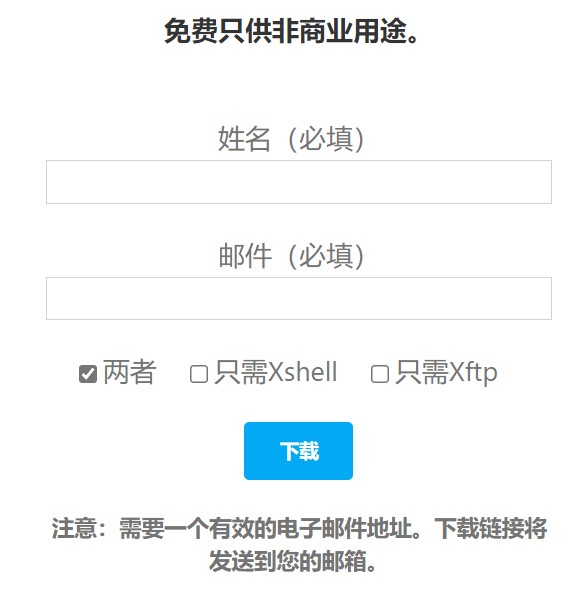
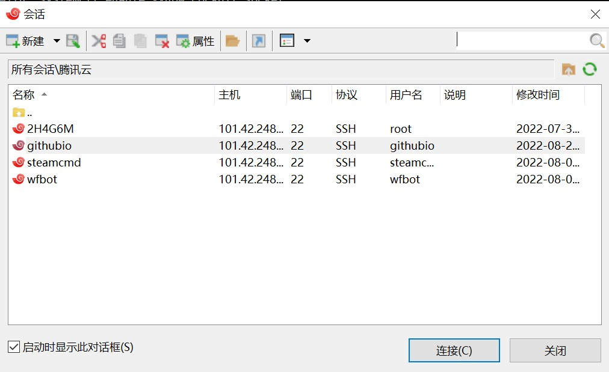
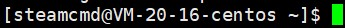
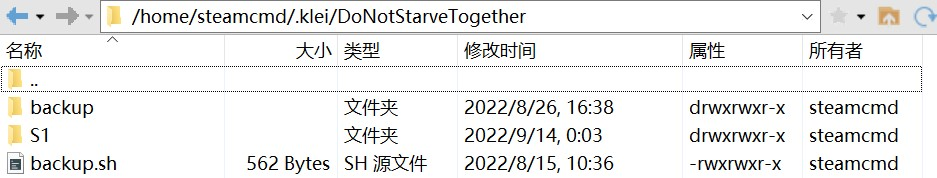
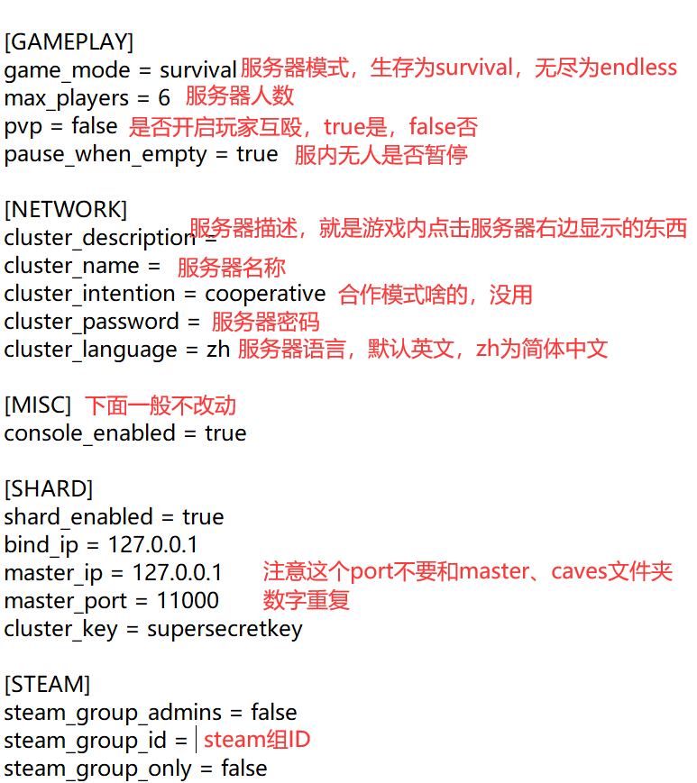

# 饥荒-萌新世界服务器基本信息

## 一、基本信息

### （一）简介

​		本文档主要用于饥荒-萌新世界服务器群组下放管理权限的部分要求及Linux饥荒服务器常用指令与代码，对分服主进行全面系统化指导,以满足分服主日常操作服务器需求。

### （二）要求

1. 不得未经主服主（以下统称版主）同意私自开设新服务器。
1. 分服主可以创设新QQ群，但服务器描述必须指向主群[551099160](https://jq.qq.com/?_wv=1027&k=LVlqLSPn)。
1. 单个服务器最高人数不得超过规定人数。
1. 服务器名称不得随意更改，可用服务器名称例如： ·萌新世界· ① ~ 轻辅助MOD生存

### （三）服务器可用数量

1. ①服(已使用)
2. ②服(暂不可申请)
3. ③④服预计2023.1月开放申请

## 二、连接服务器

### （一）需要软件

[Xshell与Xftp](https://www.xshell.com/zh/free-for-home-school/)

选中两者，填写信息即可发送下载地址到邮箱

### （二）服务器链接方法
 1. 打开Xshell与Xftp

 2. 点击左上角新建

 3. 输入版主给予的IP地址填写在主机一栏并点击连接

 4. 在新对话框中输入版主给予的账号

 5. 在新对话框中输入版主给予的密码

 6. 显示此类信息便是连接成功

    
    
 7. Xftp同理

## 三、教程

### （一）常用服务器指令

1. `screen -r dst`

   返回到饥荒服务器指令窗口，可在这里看见饥荒服务器的信息、输入饥荒代码等

2. `Ctrl+c`直接关闭当前运行的程序，如果在screen中，则是关闭饥荒服务器

3. `/home/steamcmd/dst/startDST.sh`

   开启服务器，*一定要在输入了第1个代码之后再使用*。

4. 在输入了第1个指令后按`Ctrl+a`，然后按d，隐藏饥荒服务器窗口，每次关闭xshell之前一定不要忘了输入该指令

5. `/home/steamcmd/dst/updateDST.sh`

   更新服务器。

   每次饥荒更新后，都需要更新服务器才可以在饥荒服务器列表中显示，更新完成后需要重启饥荒的服务器。

6. 按键盘中的`↑`即可直接输入上一个指令，再按一下就是再往上一个指令

### （二）配置文件位置

存档位置`/home/steamcmd/.klei/DoNotStarveTogether`

其中S1就是饥荒的存档

### （三）配置文件内容

1. `cluster_token.txt`

   保存的是科雷的服务器信息，可以在科雷官网找到

   [科雷账号官网](accounts.klei.com)

2. `cluster.ini`

   服务器信息，包括了服务器的名称、描述、密码等

   

3. `adminlist.txt`

   管理员列表，一行一个klei的ID

4. `blocklist.txt`

   封禁名单，也是一行一个ID

### （四）如何添加MOD

1. 在本地游戏中创建一个存档，并把要装的mod在本地存档中开启

2. 在游戏主页面点击数据，找到新建的存档，一般为cluster中最大的数字，打开文件夹里的Master文件，找到`modoverrides.lua`文件，复制到服务器中存档的Master和Caves中

   

3. 
